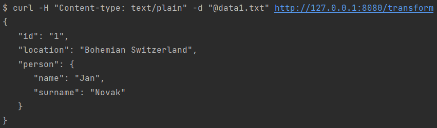
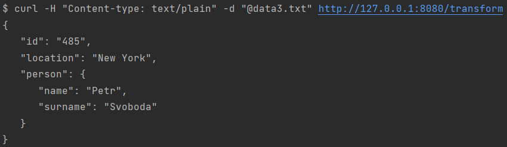

# DÚ 1

Zdrojový kód se nachází v souboru [SimpleTransform.java](https://gitlab.fit.cvut.cz/NI-AM1/B221/cs/vrabekar/-/blob/master/01/src/main/java/cz/cvut/fit/niam1/SimpleTransform.java).  
Ukázky jsou k dispozici níže.

### Příklad č. 1

Vstup: [data1.txt](https://gitlab.fit.cvut.cz/NI-AM1/B221/cs/vrabekar/-/blob/master/01/data1.txt)

### Příklad č. 2

Vstup: [data2.txt](https://gitlab.fit.cvut.cz/NI-AM1/B221/cs/vrabekar/-/blob/master/01/data2.txt)

### Příklad č. 3

Vstup: [data3.txt](https://gitlab.fit.cvut.cz/NI-AM1/B221/cs/vrabekar/-/blob/master/01/data3.txt)

