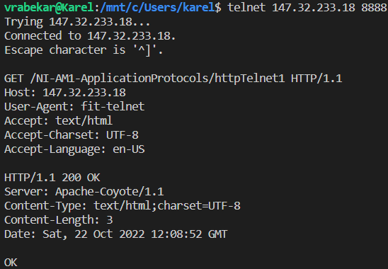
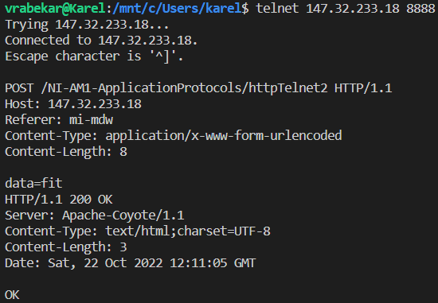
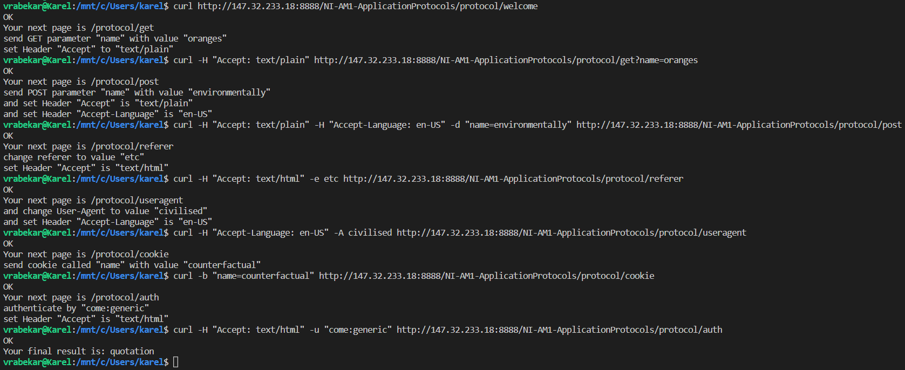

# DÚ 2

## Telnet

Tvar GET požadavku:

```
GET /NI-AM1-ApplicationProtocols/httpTelnet1 HTTP/1.1
Host: 147.32.233.18
User-Agent: fit-telnet
Accept: text/html
Accept-Charset: UTF-8
Accept-Language: en-US
```

Výpis z konzole:



Tvar POST požadavku:

```
POST /NI-AM1-ApplicationProtocols/httpTelnet2 HTTP/1.1
Host: 147.32.233.18
Referer: mi-mdw
Content-Type: application/x-www-form-urlencoded
Content-Length: 8

data=fit
```

Výpis z konzole:



## cURL

Výpis z konzole:


