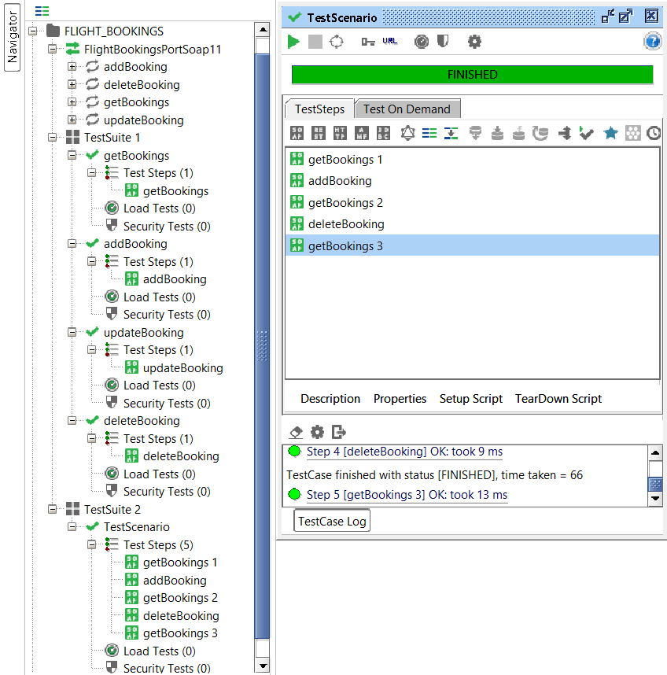
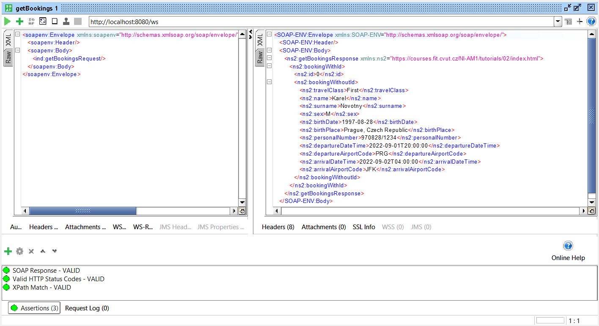
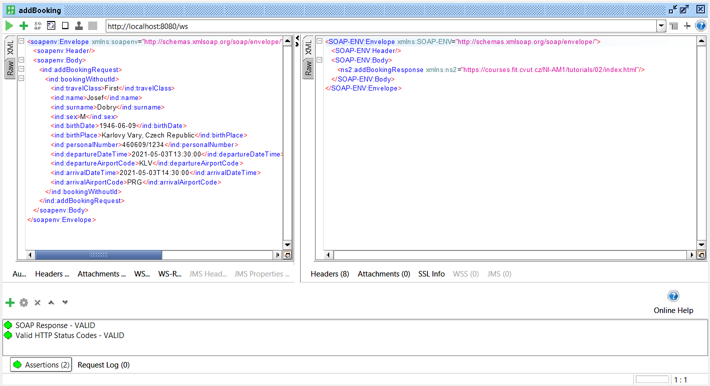
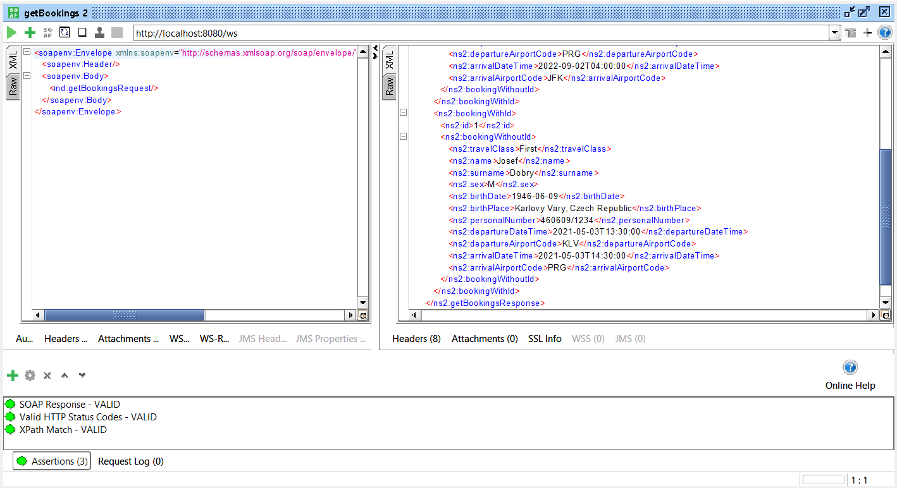
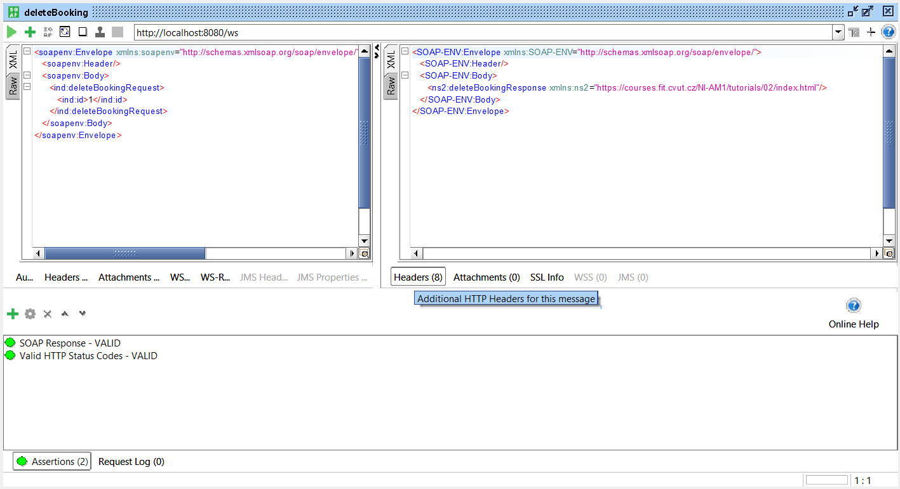
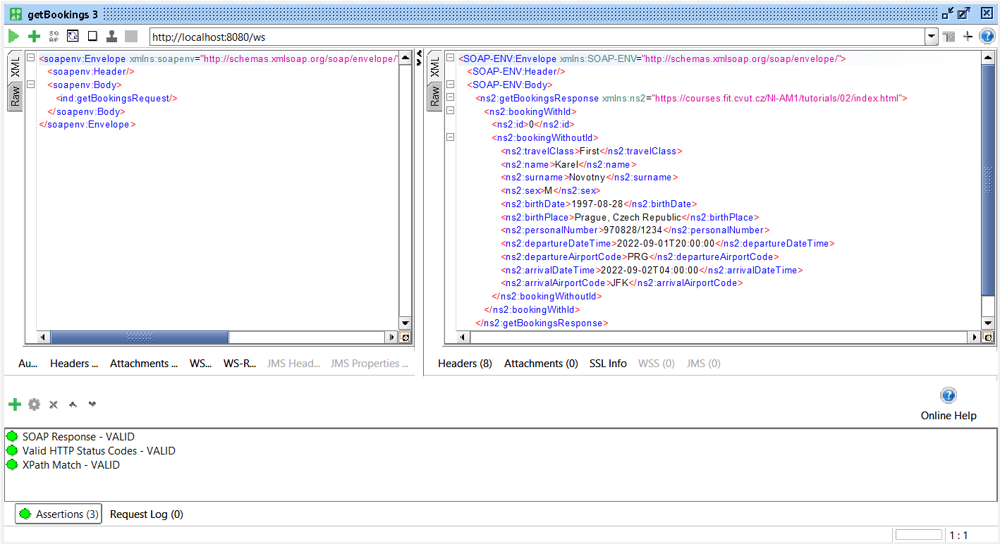

# DÚ 3

Zdrojový kód se nachází ve složce [src]().  
Ukázky jsou k dispozici níže.

### SoapUI projekt

V jednotlivých krocích používám asserty na **statové HTTP kódy** a **počet vrácených záznamů**.

### První krok

### Druhý krok

### Třetí krok

### Čtvrtý krok

### Pátý krok

