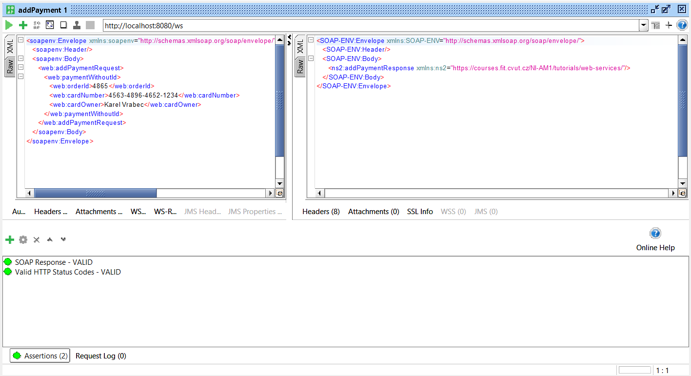

# DÚ 4

Zdrojový kód se nachází ve složce [src](https://gitlab.fit.cvut.cz/NI-AM1/B221/cs/vrabekar/-/tree/master/04/src/main/java/cz/cvut/fit/niam1/webservice).  
Ukázky jsou k dispozici níže.

### SoapUI projekt

V jednotlivých krocích používám asserty na **statové HTTP kódy** a **počet vrácených záznamů**.
V testovacím scénáři se nejdříve pokouším přidat **neplatný** a následně **platný** záznam.

### První krok

### Druhý krok

### Třetí krok

### Čtvrtý krok

### Pátý krok

